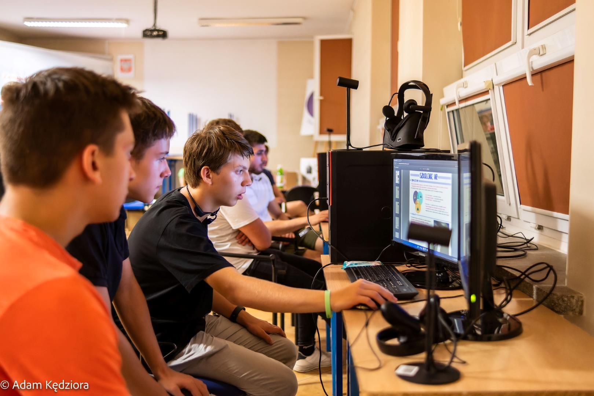
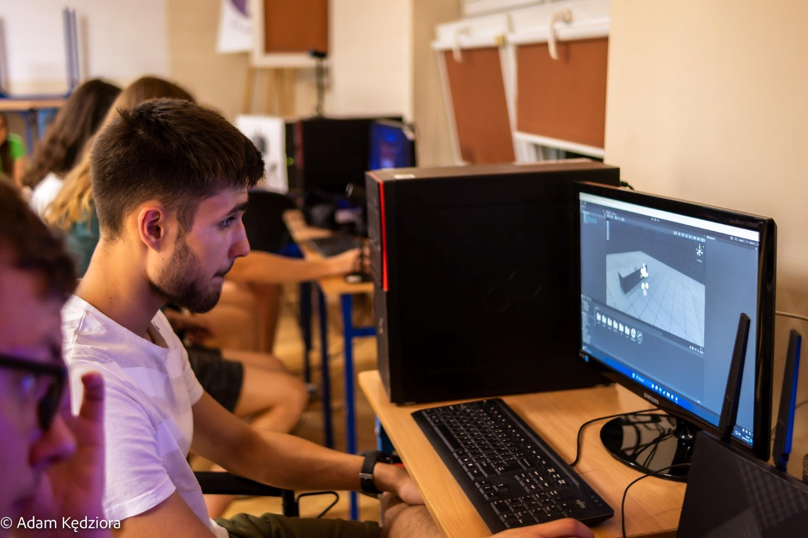
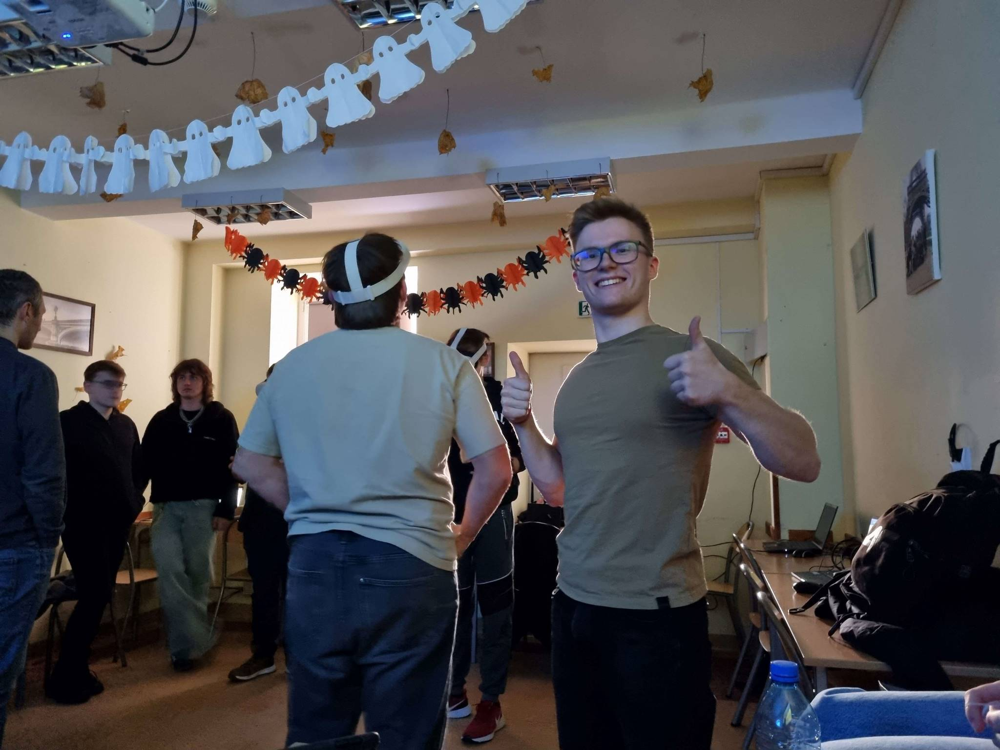
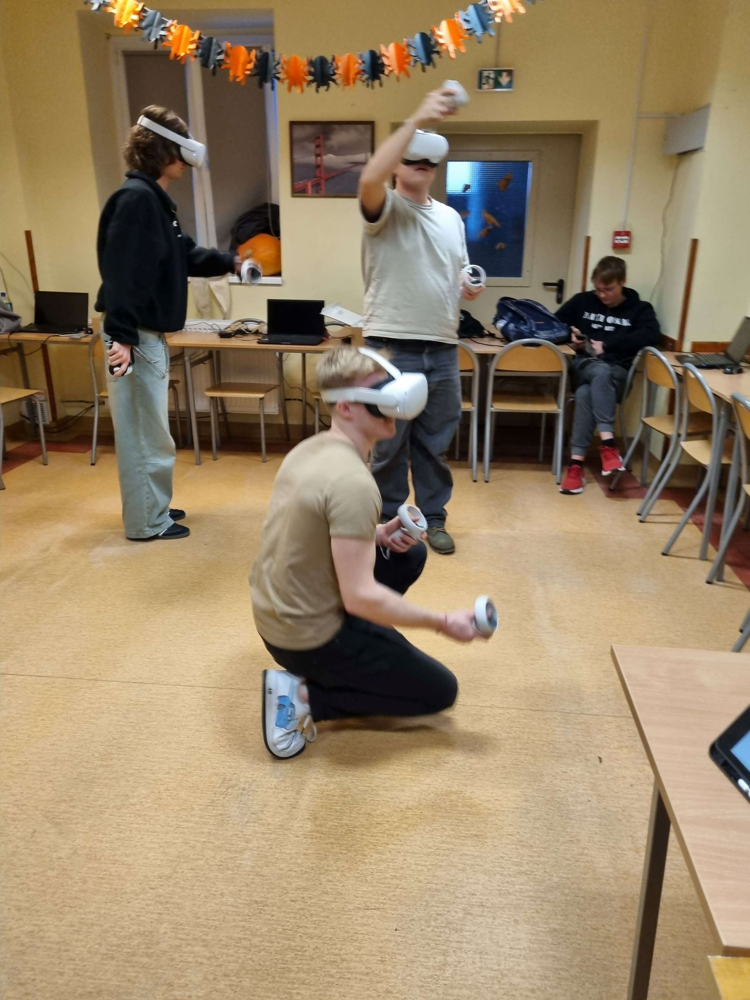
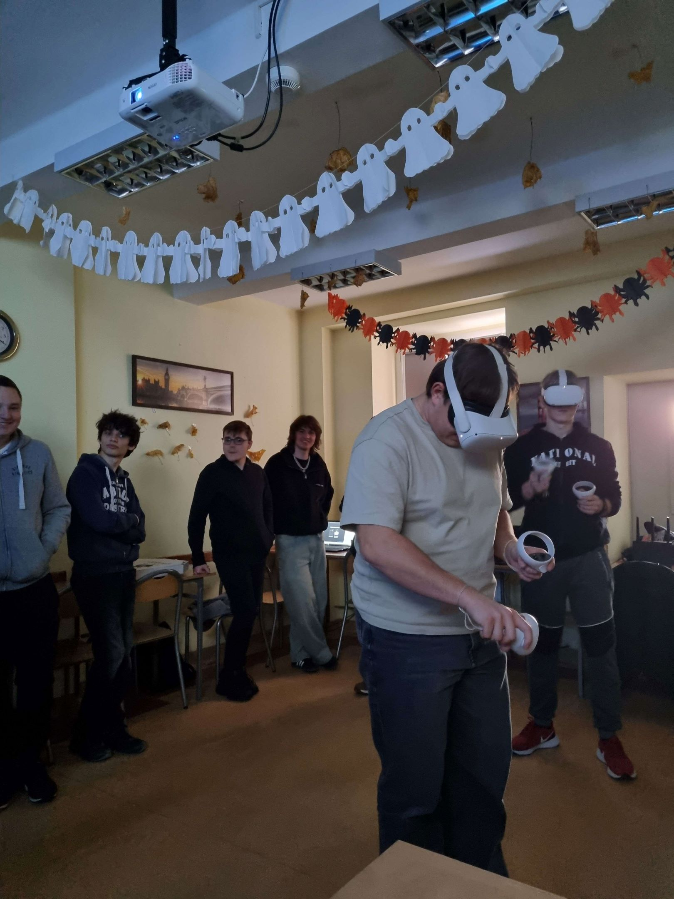

# LabVR

🚀 Witaj w LAB-VR - fascynującym projekcie, który przeniesie cię w wir nauki i odkrywania! 🎓

LAB-VR to innowacyjna symulacja klas szkolnych, gdzie fizyka staje się przygodą, geologia jest ekspedycją, astronomia to podróż po gwiazdach, a urządzenia techniki komputerowej ożywają w fascynujący sposób! 🌌🔬💻

🏫 Wprowadźmy Cię w świat interaktywnych lekcji, gdzie nauka to nie tylko siedzenie w ławce, ale prawdziwa przygoda pełna wrażeń! 

👩‍💻 Dołącz do naszej społeczności, bierz udział w projekcie, zgłaszaj pomysły i wspólnie rozwijajmy LAB-VR! Każdy wkład ma znaczenie, a nauka staje się jeszcze bardziej ekscytująca, gdy ją tworzysz razem z nami! 🤝🔍

🔧 Spróbuj teraz! Sklonuj repozytorium i wkrocz do świata LAB-VR! Czekają na Ciebie fascynujące lekcje i nieskończone możliwości! 💻💡🚀

Dołącz do naszej przygody edukacyjnej! 💪🔬🚀

## O Projekcie

Projekt LAB-VR rozpoczął się w ramach inicjatywy Kowadło 2.0, w której aktywnie uczestniczyło koło naukowe Errno. Obecnie przy rozwoju projektu pomagają uczniowie techników, ucząc się przy okazji pracy w branży gamedev.

## Dostępne sale lekcyjne

- Fizyka
- Astronomia
- Geologia
- U.T.K (Urządzenia Techniki Komputerowej)

## Warsztaty
W ramach projektu prowadzimy warsztaty z zakresu podstaw technologii XR w technikach na terenie całej polski. Notatka z warsztatów jest dostępna za darmo.
[**Pobierz notatkę**](readme-img/Notatka.pdf)

### Zespół Szkół Elektrycznych Nr 2 im. ks. P. Wawrzyniaka w Poznaniu (8.09.2023)

### Technikum Informatyczne im. ks. prof. Józefa Tischnera w Rabce-Zdroju (8.12.2023)

### Zespół Szkół nr 1 im. Mieszka I w Stargardzie (ongoing ~19.2.2024)

## Wymagania sprzętowe

Projekt działa na silniku Unity 3D 2021.3.8f1 i jest możliwy do uruchomienia natywnie na zestawie Meta Quest 2 lub lepszym

## Kontakt

Poczytaj o nas więcej!
- [Studenckie Koło Naukowe Errno](https://www.facebook.com/Errno404)
- [Propaganda Studios](https://propaganda-studios.itch.io)

